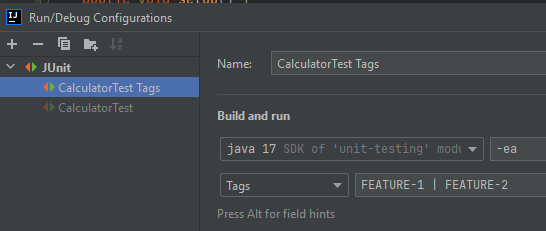

# Unit Testing Snippets

### Init schema for TDD:
* `@BeforeAll`
* `@BeforeEach`
* `@AfterEach`
* `@AfterAll`
* `@Test`
```java
class UnitStackTest {

    UnitStack<String> sut;

    @BeforeAll
    static void initAll() {
    }

    @BeforeEach
    void init() {
        sut = new UnitStack<>();
    }

    @Test
    void shouldReturnEmptyStack() {
    }
    
    @AfterEach
    void tearDown() {
    }

    @AfterAll
    static void tearDownAll() {
    }
}
```
### First test
```java
@Test
@DisplayName("Stack should be empty when is created")
void shouldReturnEmptyStack() {
    assertTrue(sut.isEmpty(), "at the beginning stack is empty");
}
```

```java
public boolean isEmpty() {
    return size() == 0;
}
```

### Basic assertions cont'd

* `assertEquals`
* `assertNonNull`
```java
    @Test
    void shouldReturnTopElement() {

        String e1 = "e1";
        String e2 = "e2";
        String e3 = "e3";

        sut.push(e1);
        sut.push(e2);
        sut.push(e3);

        assertNotNull(sut.top());
        assertEquals(e3, sut.top());
    }
```
Initial implementation with use of `Deque` instead of `Stack`:
```java
public class UnitStack<T> implements UnitStackable<T> {

    Deque<T> stack;

    public UnitStack() {
        this.stack = new ArrayDeque<>();
    }

    @Override
    public void push(T t) {
        stack.push(t);
    }

    @Override
    public T pop() {
        return stack.pop();
    }

    @Override
    public T top() {
        return stack.peek();
    }

    @Override
    public int size() {
        return stack.size();
    }

    @Override
    public boolean isEmpty() {
        return size() == 0;
    }
}
```
* `assertAll`:
```java
    @Test
    void shouldPopElementsOneByOne() {

        String e1 = "e1";
        String e2 = "e2";
        String e3 = "e3";

        sut.push(e1);
        sut.push(e2);
        sut.push(e3);

        assertAll(
                () -> assertEquals(e3, sut.pop()),
                () -> assertEquals(e2, sut.pop()),
                () -> assertEquals(e1, sut.pop())
        );
        assertTrue(sut.isEmpty());
    }
```
> _Worth to mention IntelliJ option: `Run ... with Coverage`_
* `assertThrow`:
```java
    @Test
    void shouldHandlePopElementFromEmptyStack() {
        assertThrows(NoSuchElementException.class, () -> sut.pop());
    }
```
* `assertTimeout`:
```java
    @Test
    void shouldBeFast() {
        assertTimeout(Duration.ofMillis(10), () -> sut.emptyStack());
    }
```
```java
    public void emptyStack() throws InterruptedException {
        Thread.sleep(2);
    }
```

### Disabling tests
* `@Disabled`:
```java
    @Test
    @Disabled("it is ugly test")
    void shouldBeFast() {
        assertTimeout(Duration.ofMillis(10), () -> sut.emptyStack());
    }
```

### Conditional Test Executing
* Operating system
```java
    @Test
    @DisplayName("Stack should be empty when is created")
    @EnabledOnOs(OS.MAC)
    void shouldReturnEmptyStack() {
        assertTrue(sut.isEmpty(), "at the beginning stack is empty");
    }
```
* Java version (and range)
```java
    @Test
    @DisplayName("Stack should be empty when is created")
    //@EnabledOnJre(JRE.JAVA_8)
    @EnabledForJreRange(min = JRE.JAVA_8, max = JRE.JAVA_11)
    void shouldReturnEmptyStack() {
        assertTrue(sut.isEmpty(), "at the beginning stack is empty");
    }
```
* System or environment variables
```java
    @Test
    @DisplayName("Stack should be empty when is created")
    @EnabledIfSystemProperty(named = "os.arch", matches = ".*64.*")
    void shouldReturnEmptyStack() {
        assertTrue(sut.isEmpty(), "at the beginning stack is empty");
    }
```
* Custom
```java
    @Test
    @DisplayName("Stack should be empty when is created")
    @EnabledIf("customCondition")
    void shouldReturnEmptyStack() {
        assertTrue(sut.isEmpty(), "at the beginning stack is empty");
    }

    boolean customCondition() {
        return Month.MARCH == LocalDateTime.now().getMonth();
    }
```

### Tags
Add to any test: 
* `@Tag("FEATURE-1")` 
* `@Tag("FEATURE-2")`

#### IntelliJ config


#### Maven config
```xml
<plugin>
  <artifactId>maven-surefire-plugin</artifactId>
  <version>${maven.surefire.plugin.version}</version>
  <configuration>
      <includes>
          <include>**/Test*.java</include>
          <include>**/*Test.java</include>
          <include>**/*Tests.java</include>
          <include>**/*TestCase.java</include>
      </includes>
      <excludedGroups>FEATURE-1</excludedGroups>
  </configuration>
</plugin>
```

### Parametrized tests
* `@ValueSource`:
```java
class FizzBuzzProblemTest {

    FizzBuzzProblem fizzBuzzProblem;

    @BeforeEach
    void init() {
        fizzBuzzProblem = new FizzBuzzProblem();
    }

    @ParameterizedTest
    @ValueSource(ints = {3, 21, 27, 33})
    void shouldReturnFizz(int fizzNumbers) {
        assertEquals("Fizz", fizzBuzzProblem.getFizzBuzzNumber(fizzNumbers));
    }
}
```
* `@CsvSource`:
```java
    @ParameterizedTest
    @CsvSource({"Fizz,3","Buzz,5","FizzBuzz,30","4,4"})
    void shouldReturnFizzBuzzOrNumber(String expectedValue, int number) {
        assertEquals(expectedValue, fizzBuzzProblem.getFizzBuzzNumber(number));
    }
```

* `@CsvFileSource`: 
```java
    @ParameterizedTest
    @CsvFileSource(resources = "/data/fizzbuzz.csv", delimiter = ';', numLinesToSkip = 1)
    void shouldReturnFizzBuzzOrNumber(int number, String expectedValue) {
        assertEquals(expectedValue, fizzBuzzProblem.getFizzBuzzNumber(number));
    }
```
* `@MethodSource`:
```java
    @ParameterizedTest
    @MethodSource("testData")
    void shouldReturnFizzBuzz(int number) {
        assertEquals("FizzBuzz", fizzBuzzProblem.getFizzBuzzNumber(number));
    }

    static Stream<Integer> testData() {
        return Stream.of(15,30,60);
    }
```

### Repeated
```java
    //@RepeatedTest(10)
    @RepeatedTest(value = 5, name = "{displayName} {currentRepetition}/{totalRepetitions}")
    void shouldPopElementsOneByOne() {
    }
```

### Nesting
```java
class UnitStackTest {

    UnitStack<String> sut;

    // some other tests here...
    
    @Nested
    @DisplayName("after pushing an element")
    class AfterPushing {

        String anElement = "an element";

        @BeforeEach
        void pushAnElement() {
            sut.push(anElement);
        }

        @Test
        @DisplayName("it is no longer empty")
        void isNotEmpty() {
            assertFalse(sut.isEmpty());
        }

        @Test
        @DisplayName("returns the element when popped and is empty")
        void returnElementWhenPopped() {
            assertEquals(anElement, sut.pop());
            assertTrue(sut.isEmpty());
        }
    }
}
```

### Test Execution Order
```java
//@TestMethodOrder(MethodOrderer.DisplayName.class)
@TestMethodOrder(MethodOrderer.OrderAnnotation.class)
class UnitStackTest {
    
    @Order(10)
    void test1(){}
    
    @Order(20)
    void test2(){}
}
```

### Running legacy tests
```xml
<dependency>
    <groupId>junit</groupId>
    <artifactId>junit</artifactId>
    <version>4.13.1</version>
    <scope>test</scope>
</dependency>
<dependency>
    <groupId>org.junit.vintage</groupId>
    <artifactId>junit-vintage-engine</artifactId>
    <version>${junit.vintage.version}</version>
    <scope>test</scope>
</dependency>
```

### Generating report
```bash
mvn clean verify surefire-report:report
```
> A HTML report should be generated in: `${basedir}/target/site/surefire-report.html`.